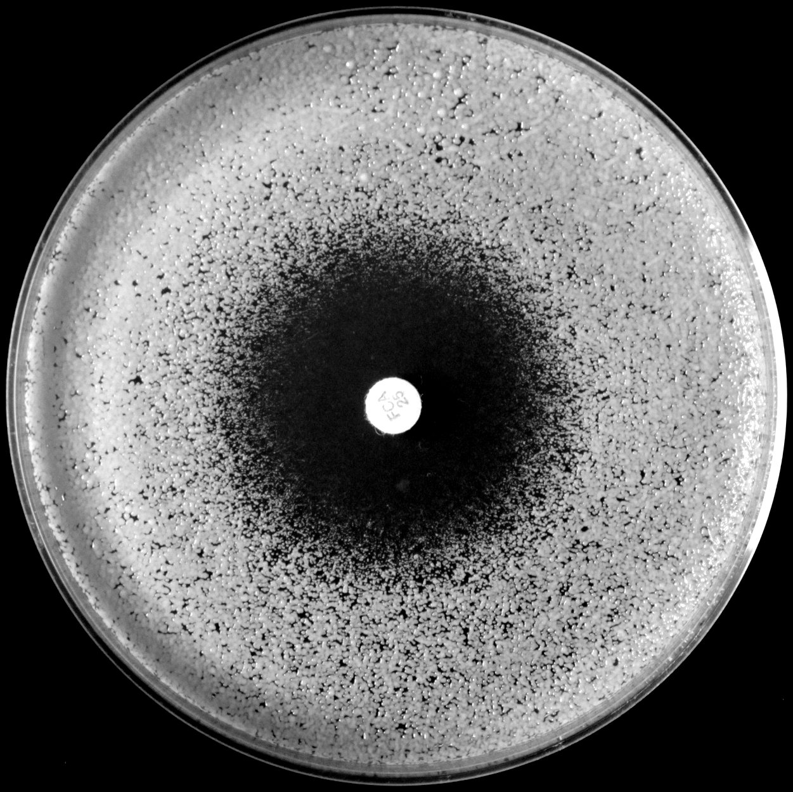

```{r setup, message=FALSE, echo=FALSE}
library(knitr)
# This is necessary to direct knitr to find the 
# 'data', and other directories that contain
# files needed to execute this document
# thanks to http://stackoverflow.com/a/24585750/1036500
# opts_knit$set(root.dir=normalizePath('../'))
# opts_chunk$set(fig.path = "../figures/")
```

```{r, echo = FALSE}
knitr::opts_chunk$set(collapse = TRUE, comment = "#>")
```

```{r, echo=FALSE}
library("diskImageR")
```


## Introduction to diskImageR

diskImageR provides a quantitative way to analyze photographs taken from disk diffusion assays, and removes the need for subjective measurement by assessing zone diameter with a ruler. This computational method measures the zone of inhibition (i.e., resistance) at three different points (80%, 50% and 20% growth inhibition) as well as two measures of tolerance, how much growth there is above the zone of inhibition (area under the curve), and the rate of change from no growth to full growth (sensitivity).

<center>
  
</center> 

## Prepare plates and photographs
The analysis done by diskImageR will only be as good as your disk assay plates and the photographs you take. Plates should always be labelled on the side, not on the bottom. Care should be taken when setting up the camera to take photographs, as you want the lighting conditions to be as uniform as possible, without any shadows on the plates. Camera settings should be manual rather than automatic as much as possible. Once you have the set of photographs that you want to be analyzed together they should be placed in the same directory, with nothing else inside that directory.

Photograph naming can be used downstream to have diskImageR do a number of statistical things (e.g., averaging across replicates, caulculations of variance, t-tests). The general format is "strain_factor1_factor2_rep.pdf". Conversely, if you intend to do all the statistical analysis later, photographs can be named anything, even numbered.

Finally, photographs should be cropped carefully around the disk. 

<b> Important! </b> There can not be any spaces or special characters in any of the folder names that are in the path that will lead to your pictures or the directory that you will use as the main project folder (i.e., the place where all the output files from this package will go). 

## Run the imageJ macro on the set of photographs
The first step in the diskImageR pipeline is to run the imageJ macro on the photograph directory. 

<b> Important! </b> imageJ must be installed on your computer. ImageJ is a free, public domain Java image proessing program available for download <a href="http://rsb.info.nih.gov/ij/download.html"> here</a>. Take note of the path to imageJ, as this will be needed for the first function. If you install it to default location (Applications folder on a mac, Program Files folder on a PC) then you should be able to use the default setting )see below)

From each photograph, the macro (in imageJ) will automatically determine where the disk is located on the plate, find the center of the disk, and draw 40mm lines out from the center of the disk every 5 degrees. For each line, the pixel intensity will be determined at many points along the line. This data will be stored in the folder *imageJ-out* on your computer, with one file for each photograph.

To run the imageJ macro through a user-interface with pop-up boxes to select where you want the main project directory to be and where to find the location of the photograph directory just select a project name (here I'm using 'vignette'):
```r
IJMacro("vignette")
```

If you would prefer to avoid pop-up boxes you can specify your desired main project directory and photograph directory locations:

```{r}
IJMacro("vignette", projectDir= getwd(), pictureDir = file.path(getwd(), "pictures", ""))
```
Depending on where imageJ is located on your computer, the script may not run unless you specify the filepath to imageJ. See ?IJMacro for more details.

If you want to access the output of the imageJ macro in a later R session you can with
```r
readExistingIJ("projectName") 	#can be any project name, does not have to be the same as previously used
```
### [optional] Plot the imageJ output
To plot pixel intensity from the average from all photographs use:
```{r, fig.width=6, fig.height=4}
plotRaw("vignette", popUp = FALSE, savePDF = FALSE)
```

## Run the maximum likelihood analysis 
The next step is to use maximum likelihood to find the logistic and double logistic equations that best describe the shape of the imageJ output data. These data follow a characteristic "S-shape" curve, so the standard logistic equation is used where asym is the asymptote, od50 is the midpoint, and scal is the slope at od50 divided by asym/4.
$$
y = \frac{asym*exp(scal(x-od50))}{1+exp(scal(x-od50))}+N(0, \sigma)
$$

We often observed disk assays that deviated from the single logistic, either rising more linearly than expected at low cell density, or with an intermediate asymptote around the midpoint. To fascilitate fitting these curves, we fit a double logistic, which allows greater flexibility. Our primary goal in curve fitting is to capture an underlying equation that fits the observed data, rather than to test what model fits better.
$$
y = \frac{asymA*exp(scalA(x-od50A))}{1+exp(scalA(x-od50A))}+\frac{asymB*exp(scalB(x-od50B))}{1+exp(scalB(x-od50B))}+N(0, \sigma)
$$

From these functions we substract off the plate background intensity from all values; this is common across all pictures taken at the same time and is determined from the observed pixel intensity on a plate with a clear halo (specified by the user). We then use the parameters identified in the logistic equations to determine the resistance parameters.

* <b>Resistance</b>
	: asymA+asymB are added together to determine the maximum level of intensity (= cell density) achieved on each plate. The level of resistance (zone of inhibition, ZOI), is calculated by asking what x value (distance in mm) corresponds to the point where 80%, 50% and 20% reduction in growth occurs (corresponding to *ZOI80*, *ZOI50*, and *ZOI20*)
* <b>Tolerance</b>
	: the 'rollmean' function from the zoo package is used to calculate the area under the curve (AUC)  in slice from the disk edge to each ZOI cutoff. This achieved growth is then compared to the potential growth, namely, the area of a rectangle with length and height equal to the ZOI. The calculated paramaters are thus the fraction of full growth in this region (*fAUC80*, *fACU50*, *fAUC20*).
* <b>Sensitivity</b>
	: the ten data points on either side of the midpoint (od50) from the single logistic equation are used to find the slope of the best fit linear model using the lm function in R.

```{r,  fig.width=5, fig.height=4}
maxLik("vignette", clearHalo=1, ZOI="all", needML=TRUE, popUp = FALSE, savePDF =FALSE, AUC=20)
```

### [OPTIONAL] Save the maximum likelihood results
It is possible to save the maximum likelihood results using
```
saveMLParam("vignette")
```
This will save a .csv file into the *paramter_files* directory that contains parameter estimates for asym, od50, scal and sigma, as well as the log likelihood of the single and double logistic models.
 
## Save the results 
The last required step creates and save a dataframe with the resistance parameter estimates. A .csv file is written to the *parameter_files* directory which can be opened in excel or any program that opens text files. 

```{r}
createDataframe("vignette", clearHalo = 1, typeName="temp")
vignette.df
```

### [OPTIONAL] Add additional factor columns
If your photograph names contain more than one factor that is important (i.e, if your files names look like: line_factor1_factor2...") you can add extra factors into the dataframe using

```{r}
addType("vignette", typeName="rep")
vignette.df
```
If you want to access this dataframe in a later R session you can do so using readExistingDF("projectName"). Any project name can be used here, not only the previous name. This file can also be loaded in standard ways (e.g., temp <- read.csv(file)) though if you intend to use the functions below, you need to save it with a name that ends with ".df" (i.e., temp.df).

### [OPTIONAL] Aggregate replicate pictures
This function is useful if you have many replicate disk assays and want to calculate their average and variance. The function will calculate the standard error (se), coefficient of variantion (CV) or generic R variance measures (e.g., standard deviation, sd). 

For this example I am loading an existing dataset tha I will call "manyReps". This dataset contains data for seven different lines, with twelve replicates per line, and a factor I'm interested in that has two two levels. I can then use the function aggregateData to average among the 12 replicates and calculate their standard deviation. Note that you can "cheat" - as long as you save your dataframe with .df at the end of the name you can run \code{\link{aggregateData}} on any dataframe, not just one imported with \link\code{readExistingDF}}.

```{r}
manyReps.df <- read.csv(file.path(getwd(), "data", "manyReps_df.csv"))
head(manyReps.df)
```

```{r}
aggregateData("manyReps", replicate=c("line", "type"), varFunc="se")
manyReps.ag
```
This will also save a .csv file into the *parameter_files* directory.

### [OPTIONAL] Plot parameter results
At this point the parameter esitmates and potentially aggregated and variance measurements exist in .csv files and can be used independently of the package. Three plotting functions are included here though, to plot single parameters (any) \link{\code{oneParamPlot}}, two parameters (ZOI and fAUC) \link{\code{twoParamPlot}} or three parameters (ZOI, slope, fAUC) \link\code{threeParamPlot}}. Input can be the dataframe from either \link{code{createDataframe}} \code{type="df"} or from \link{code{aggregateData}} \code{type=="ag"}. Single parameter plot can be either a barplot \code{barplot = TRUE} or a dotplot \code{barplot=FALSE}. In the two and three parameter plots the default is to plot tolerance as a barplot and ZOI and slope as a dotplot, tolerance can also be plotted as a dotplot with \code{barplot=FALSE} though there is currently not support to plot either ZOI or slope as a barplot in this framework. 

```{r, fig.width=5, fig.height=4}
twoParamPlot("manyReps", type= "ag", popUp = TRUE, savePDF =FALSE, xlabAngle = -45, order = c(1, 8, 2, 9, 3, 10, 4, 11, 5, 12, 6, 13, 7, 14), xlabels =paste(rep(manyReps.ag$line[1:7], each=2), rep(c("A", "B"), 7), sep="-"))
```

There is also a built in plotting function to plot the two groups on top/beside of each other, with all the same options as previously described.
```{r, fig.width=5, fig.height=4}
twoParamTwoGroupPlot("manyReps", type="df", popUp = TRUE, savePDF =FALSE, xlabAngle = -45)
```


## Addendum
#### Forthcoming
* basic t-tests (t.test)
* basic anova (aov)
* single parameter graphics
* three parameter graphics

#### Acknowledgements
Thank you to Adi Ulman for the original motivation, Noa Blutraich, Gal Benron and Alex Rosenberg for testing versions of the code presented here, and Darren Abbey and particularly Judith Berman for philosophical discussions about how best to computationally capture the biological variation observed in the disk assay.

#### Contact
Aleeza Gerstein, <gerst035@umn.edu>
