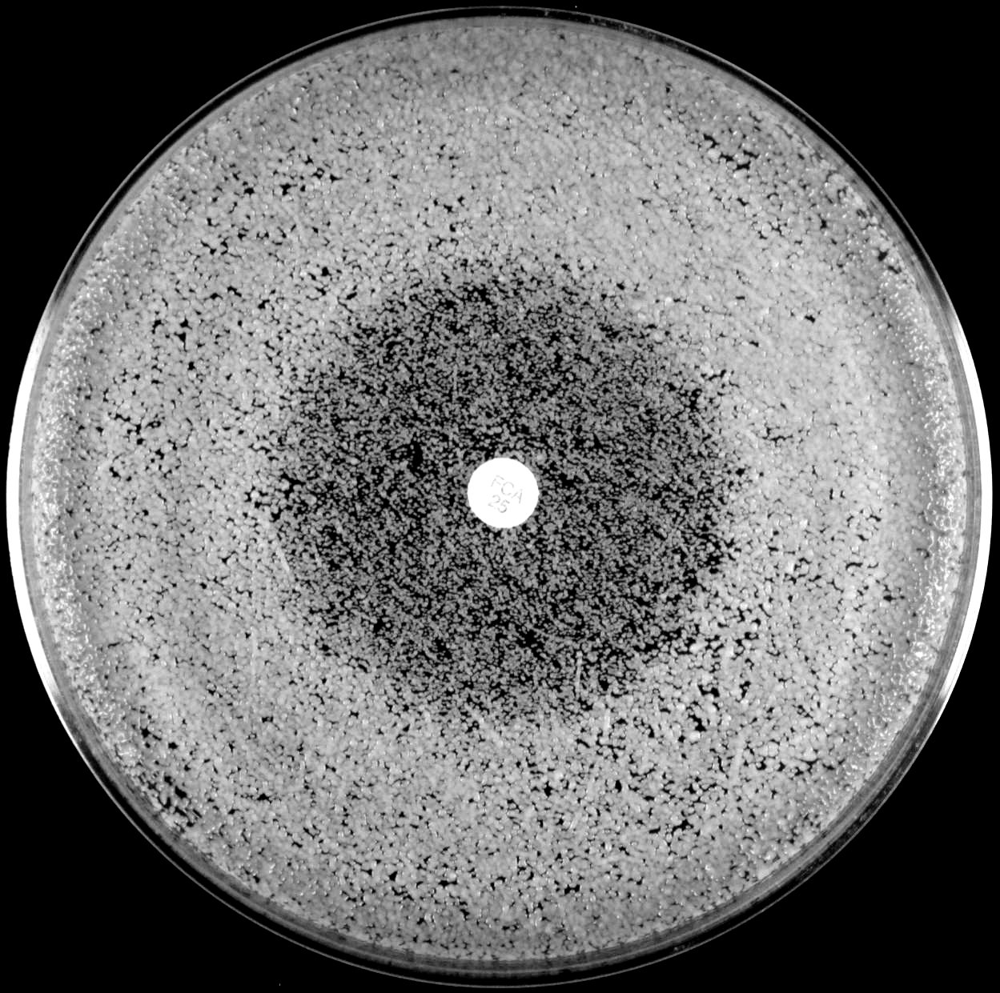
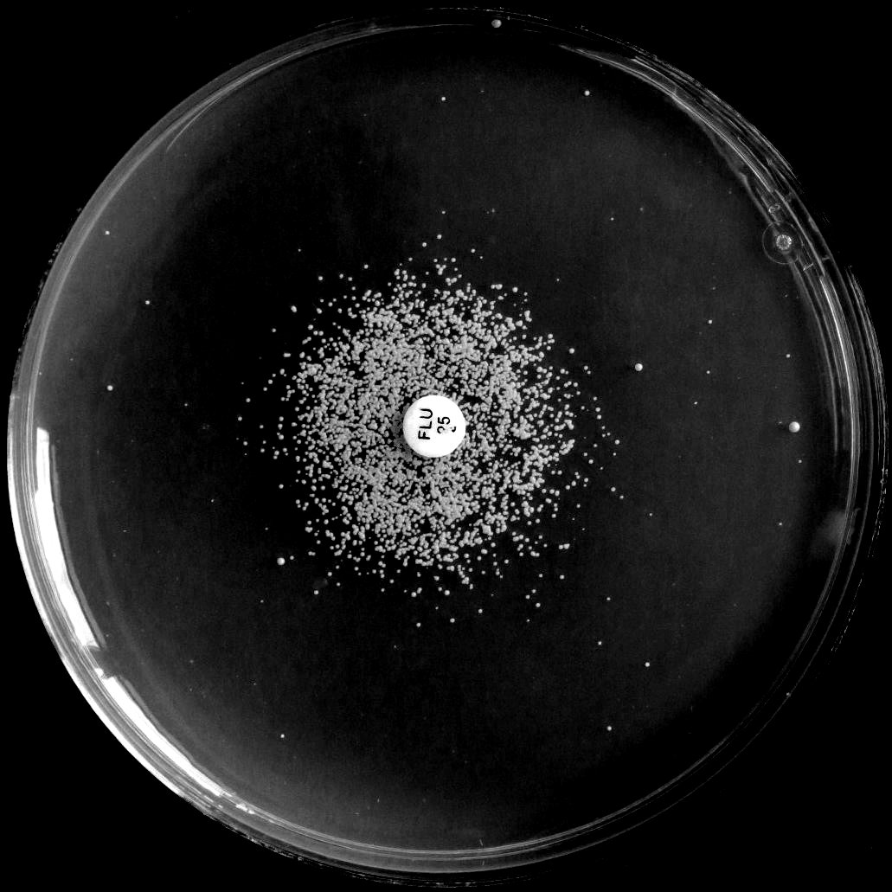

```{r setup, message=FALSE, echo=FALSE}
library(knitr)
# This is necessary to direct knitr to find the 
# 'data', and other directories that contain
# files needed to execute this document
# thanks to http://stackoverflow.com/a/24585750/1036500
# opts_knit$set(root.dir=normalizePath('../'))
# opts_chunk$set(fig.path = "../figures/")
```

```{r, echo = FALSE}
knitr::opts_chunk$set(collapse = TRUE, comment = "#>")
```

```{r, echo=FALSE}
library("diskImageR")
```

## <i>diskImageR</i>: Quantification of resistance and tolerance to antimicrobial drugs using disk diffusion assays

### Introduction to <i>diskImageR</i>
The R package `diskImageR` provides a pipeline to analyze photographs of disk diffusion plates. This removes the need to analyze the plates themselves, and thus analysis can be done separate from the assay. For typical disk assays, <i>diskImageR</i> measures drug resistance as the zone of inhibition, i.e.,the radius at multiple cutoff values where growth reaches 20\%, 50\%, or 80\% of maximal growth, and measures drug tolerance as the fraction of the subpopulation that is able to grow above the resistance point ("FoG"). For counfounding growth (where the observed population growth is highest at high drug concentration and decreases to no growth at low concentrations), <i>diskImageR</i> measures the zone of disinhibition as the point where growth is reduced by 20\%, 50\%, or 80\% below the maximal growth. For paradoxical growth, where high growth is observed at both high and low drug concentrations but decreases at intermediate concentration, <i> diskImageR</i> measures the radius of maximum inhibition, i.e., the point where the least amount of growth is observed. 

#### Typical disk assays examples:
Left - low tolerance, Right - high tolerance, appoximately the same level of resistance
<center>
  
</center> 

#### Atypical disk assays
Left - Confounding growth, Right - Paradoxical growth

<center>
 

### <i>diskImageR</i> function overview (in the typical order of use)
* `IJMacro`: runs an ImageJ macro on the folder that contains the photograph to be analyzed [required]
* `readInExistingIJ`: used to read in existing ImageJ analyses [optional]
* `plotRaw`: used to plot the results of ImageJ analysis [optional]
* `maxLik`: maximum likelihood inference to fit models to the data [required]
* `saveMLParam`: save the output of maximum likelihood analysis [optional]
* `createDataframe`: dataframe creation of all parameter estimates [required]
* `addType`: add a factor column to parameter estimate dataframe [optional]
* `aggregateData`: averages data from photographs of the same strain & type [optional]
* `calcMIC`: calculate the MIC from RAD values [optional]
* `readExistingDF`: read in an existing dataframe using a pop-up box [optional]
* `oneParamPlot`: plot a single resistance or tolerance parameter [optional]
* `twoParamplot`: plot resistance (RAD) and tolerance (FoG) at a specified cutoff value [optional]
* `threeParamplot`: plot resistance (RAD), tolerance (FoG), and sensitivity (slope) [optional]

If all of your images to analyze are of typical disk assays, <i>diskImageR</i> should be on the default mode, which is the version that has been avaiable on CRAN since 2015. If your folder contains any atypical images, as of August 2023 <i>diskImageR</i> is able to run in atypical mode, by setting the argument "typical = FALSE" within the functions `maxLik()`,`saveMLParam()`, and `createDataframe()`, as described at the end of this document. Atypical mode is currently only hosted on GitHub, though we expect to update the CRAN version soon.

See the end of this document for the skeleton walkthrough of package use, or the document "walkthrough.R" that is available in the diskImageR library directory. All of this can also be found on <a href="https://www.microstatslab.ca/diskimager.html">The MicroStats Lab</a> website.

### Required software
If you do not have R (or R Studio) installed on your computer, that is step one. The use of `diskImageR` does not require prior knowledge of R and it is the goal of this tutorial to walk through everything that is necessary to analyze photographs of disk diffusion assays. Once the package has been loaded into R, support for all built-in function can be found by typing `?functionName` in the R console.

The first step of `diskImageR` analyzes the disk diffusion photographs in ImageJ, a free, public domain image processing program available for download (http://rsb.info.nih.gov/ij/download.html). If possible ImageJ should be installed to the default location (Applications folder on a Mac, Program Files folder on a PC). If it is installed in a different location you will need to specify the path to ImageJ (see `?IJMacro` after package install). On a Mac, if you do not already have Xcode you will need to download it from the Apple Developer tools (https://developer.apple.com/xcode/download/). You may be prompted to download and install other additional programs in the R console if any are required (depends on what is already on your computer). 

The primary output of `diskImageR` is CSV files that can be opened and used in any approprate program (e.g., Microsoft Excel) and a series of PDF figures that can be customized within the package functions. 

### Prepare plates and photographs
The analysis done by `diskImageR` will only be as good as the photographs taken of the disk assay plates. We use the Bencher Copymate II camera mounting system. In this setup there are two fluorescent lights on either side of the disk, oriented to minimize shadows on the plate in an otherwise dark room. We use the Canon Rebel T3i camera with an ISO 800, white balance "white fluorescent light", time 1/100s, picture stype "neutral", centre focused. Any camera of reasonably high quality should suffice, though the camera should always be set in manual rather than automatic mode, as the goal is to take photographs as consistently as possible. We also use the 2s timer to avoid potentially jostling the camera while taking images and/or having a hand/arm shadow in the picture. Plates should be photographed on a dark surface (we use black velvet) and plate labels are written on the side rather than the bottom of the plate. We have also used `diskImageR`  with the XXX scanner on XXX settings. 

Prior to analysis, images should be cropped close to the plate (as above). Because the analysis program automatically detects the disk based on size, it is important that no other similar-sized circles be present in the image (e.g., from letters in labels).

Once you have the set of photographs that you want to be analyzed together they should be placed in the same directory, with nothing else inside that directory. 
<b>Important!</b> If there are any other files within the directory the script will not run properly.

The photograph file naming scheme will be be carried throughout, thus care should be taken with naming photographs in a logical manner. The general format that we use is "strain_factor1_factor2_rep.jpg". This format will allow you to use a built-in function to average across replicate photographs from the same strain. Conversely, if you intend to do this separately (or not at all) the photographs can be named anything. 

### Run the ImageJ macro on the set of photographs
The first function of the package is `IJMacro()`. From each photograph, an ImageJ macro that is included in `diskImageR` will automatically open each photograph from the specified directory, determine where the disk is located on the plate, find the center of the disk, and draw 40mm radial lines out from the center of the disk every 5 degrees. For each line, the pixel intensity will be determined at many points along the line using the built-in `plot profile` macro from ImageJ. This data will be stored in the folder *ImageJ_out* on your computer, with one file for each photograph.

`IJMacro()` can be run in two different ways, either through a user-interface with pop-up boxes, or directly through the R console. At this point you will specify a project name, the main project directory, and the photograph directory.
The project name should ideally be fairly short (easy to type without typos!) and specific to the project. It must start with a letter, not a number or special character, but can otherwise be anything. The project name must always be specified with quotation marks around it (a surprisingly common error). Otherwise there will be a red error message (like <span style="color:red">Error in IJMacro(newProject) : object 'newProject' not found</span>).
The main project directory is the place where all files generated by the package will be saved within three directories: <i>ImageJ_out</i>, <i>parameter_files</i> and <i>figures</i>. A sub-directory will be created within each of these directories with the project name for organizational purposes, so that multiple different experiments/sets of analyses can be easily conducted from the same main project directory.
The photograph directory is the one used to store photographs from above (which has nothing except the photographs to be analyzed in it). 

<b> Important! </b> There can not be any spaces or special characters in any of the folder names that are in the path that lead to either the main project directory or the photograph directory. If there are an error box titled "Macro Error" will pop up and the script will not run (the red error message <span style="color:red">Error in tList[[i]]: subscript out of bounds</span> will also show up in the R console). 
The default assumption here and in all funtions is that the disk size is the standard 6mm. If you are using custom-sized disks you will need to specify that with the argument `diskDiam = X`, where X is the size of your disk in mm. This should also be specified in the functions `plotRaw()`, `maxLik()` and `createDataframe()`, discussed below. You will also need to change the argument `standardLoc` in `maxLik()` and `createDataframe(). standardLoc is a numberic value that indicates the location (on the disk) to use to standardize intensity across photographs. The position of standardLoc is a position that should theoretically have the same intensity in all photographs, i.e., the white of the disk. The defaul value (2.5mm) was chosen after testing of 6mm disks that contain some writing. If smaller disks are used standardLoc should be scaled appropriately. You can see where standardLoc falls in each photograph in \code{plotRaw} (the red dashed line when `plotStandardLoc = TRUE`). To suppress this standardization use `standardLoc = FALSE`.

To run the ImageJ macro through a user-interface with pop-up boxes: 
```r
IJMacro("newProject")
```

If you would prefer to avoid pop-up boxes you can directly specify the main project and photograph directory locations:
```r
IJMacro("newProject", projectDir= "/path/to/projectDir", photoDir = "/path/to/projectDir/photographs/")
```

```{r, echo=FALSE}
IJMacro("newProject", projectDir= getwd(), photoDir = file.path(getwd(), "pictures", ""))
```

If `IJMacro()` is unable to locate ImageJ a red error will pop-up with a message like <span style="color:red">/bin/sh: /Applications/ImageJ/ImageJ.app/Contents/MacOS/JavaApplicationStub: No such file or directory</span>. The easiest solution is to move ImageJ to the default location or to specify the path to ImageJ with argument `ImageJLoc = "/path/to/ImageJ"`. 

<b> Important! </b> `IJMacro()` must run completely, without error, for everything downstream. In our experience this is the most likely step for errors to occur. Errors will be indicated in the R console should they arise, and will hopefully give you clues as to what the problem is if they are different than those described above. 

After `IJMacro()` has run successfully the output of the ImageJ analysis can be found in the *ImageJ_out* directory, though this is probably not particularly helpful unless you want to see the intensity calculations from each line. The information about the average line from each photograph can be found in the "averageLines.csv" file located in the *parameter_out* folder. This is the information that is used for all further analysis within `diskImageR` and may be useful for other purposes.

To access the output of the ImageJ analysis in a later R session use the function `readInExistingIJ()` (e.g., if you ran `IJMacro()` on a separate day then you want to conduct the downstream analyses). At this step you can also change the project name, you do not have to specify the same name that was used originally. If the name is changed new subdirectory folders will be created within the main project directory. This function will bring up a pop-up box to select the main project folder and select the directory that contains the existing ImageJ output files.

```r
readInExistingIJ("betterName") 
```

### Plot the output of ImageJ analysis
The optional function `plotRaw()` will create a PDF file of plots saved to the *figures* directory that show the average pixel intensity across all 72 lines from each photograph (i.e., the data that can be found in the "averageLines.csv" file). This function is a good check to see whether the analysis proceeded properly and in and of itself may be useful to visualize differences between different strains or experimental factors.

```{r, fig.width=6, fig.height=4}
plotRaw("newProject", showNum = TRUE, popUp = FALSE, savePDF = FALSE)
```

Many different arguments can be specified to influence the plots and the PDF that is generated, including the minimum and maximum x and y values (`xmin`, `xmax`, `ymin`, `ymax`), the number of plots in each row (`xplots`), the height and width of the PDF file (`height`, `width`), the point size (`cexPt`), and the size of the x- and y-axis font (`cexX`, `cexY`). As with all functions, you can type `?plotRaw` into the R console for all options and to see default values.

### Run the maximum likelihood analysis 
The next step is the function `maxLik()`, which uses maximum likelihood to find the logistic and double logistic equations that best describe the shape of the ImageJ output data. Our primary goal in curve fitting is to capture an underlying equation that fits the observed data. These data follow a characteristic "S-shape" curve, so the standard logistic equation is used where <i>asym</i> is the asymptote, <i>od50</i> is the midpoint, and <i>scal</i> is the slope at <i>od50</i> divided by <i>asym</i>/4. The midpoint from the single logistic is used to determine sensitivity.
$$
y = \frac{asym*exp(scal(x-od50))}{1+exp(scal(x-od50))}+N(0, \sigma)
$$

We often observed disk assays that deviated from the single logistic, either rising more linearly than expected at low cell density, or with an intermediate asymptote around the midpoint. To fascilitate fitting these curves, we also fit a double logistic, which allows greater flexibility. In practice, as the double logistic has extra parameters, it will always provide a closer fit to the underlying data, thus the results of this model are used to determine the resistance and tolerance parameters. 

$$
y = \frac{asymA*exp(scalA(x-od50A))}{1+exp(scalA(x-od50A))}+\frac{asymB*exp(scalB(x-od50B))}{1+exp(scalB(x-od50B))}+N(0, \sigma)
$$

Depending on the number of photographs to be analyzed, `maxLik()` can take a fair amount of time, upwards of an hour or more. This is due to the maximum likelihood fitting procedures, which determine the best fit parameters from multiple different starting values. The status is indicated by a series of dots (".") in the R console, with one dot per photograph. This procedure is the find.mle routine from the <a href="https://github.com/richfitz/diversitree">diversitree</a> package written by Richard Fitzjohn. If for some reason the procedure gets halted in the middle of `maxLik()` (e.g., computer is shut down) as long as R remains open it should resume where it left off when the computer is reactivated.

<i>diskImageR</i> is able to standardize the pixel intensity in two different ways. The default method is to use one photo with clear background near the drug disk (described below). This is required if you want to obtain tolerance measurements. The second method is to standardize each photo individually based on the minimum pixel intensity measured. To use the second method, use `standType = "indiv"`. <b>NOTE: </b> `standType = "indiv"` is not supported when `typical = FALSE`. 

The specified plate background intensity is subtracted off the intensity from all values; this should be common across all photographs taken at the same time. If you are using plates with different coloured base medium, their photographs should be analyzed separately, as there will be a different background intensity from different plates. The background intensity is determined from the observed pixel intensity right beside the disk on a plate where there are no colonies in this area (e.g., the typical photograph on the left above). This must be specified by the user through the argument `clearHalo = #`, where # is the numbered location of the appropriate photograph. Photographs are always analyzed and organized in alphabetical order; the order can be determined by typing `names(newProject)` (no quotation marks around the project name) in the R console. In our experiments we tend to have at least one appropriate photograph with a clear halo beside the disk. A good practice, however, would be to always take a photograph of a blank plate with just the disk in the center to use for this purpose (and save it with a name like "a" so that it is always the first photograph in the list (i.e., `clearHalo = 1`). The (non)results from this photograph can be removed in the function `createDataframe()` below.

The output of `maxLik()` is a list that is saved to the R environment and a PDF file with one plot per photograph that shows the results of the model fitting (saved to the *figures* directory). Many aspects of this figure can be specified including the maximum y axis (`ymax`) the number of plots on the x axis (`xplots`), the height and width of the PDF file (`height`, `width`), the values of RAD to be plotted (one of `80`, `50`, `20`, or `all`) and FoG cutoff value to plot (one of `80`, `50`, or `20`). Once `maxLik()` has been run once (in a given R session), it does not need to be rerun to made adjustments to the PDF file; to make a new figure use the argument `needML = FALSE`. The default is to save only a single PDF file (i.e., to repeatedly overwrite the same file with different figure iterations), this can be supressed with the argument `overwrite = FALSE`. 

```{r,  fig.width=5, fig.height=4}
maxLik("newProject", clearHalo=1, RAD="all", FoG=20, needML=TRUE, overwrite = TRUE, popUp = FALSE, savePDF = FALSE)
```

<b>[OPTIONAL] Save the maximum likelihood results</b>
If you are intersted in the nuts and bolts of the maximum likelihood parameters it is possible to save these results using the `saveMLParam()` function, which will save a CSV file into the *paramter_files* directory that contains parameter estimates for <i>asym</i>, <i>od50</i>, <i>scal</i> and <i>sigma</i>, as well as the log likelihood of the single and double logistic models.
 
```
saveMLParam("newProject")
```
 
### Create and save a dataframe of parameter estimates
The last required step is to run the function `createDataframe()` to create and save a dataframe with the drug response parameter estimates, using the best fit parameters from the logistic equations:

* <b>Resistance (<i>RAD</i>)</b>
	: asymA+asymB are added together to determine the maximum level of intensity achieved on each plate (= cell density). The level of resistance (radius of inhibition, RAD), is calculated by asking what x value (distance in mm) corresponds to the point where 80%, 50% and 20% reduction in growth occured (corresponding to *RAD80*, *RAD50*, and *RAD20*)
* <b>Tolerance (<i>FoG</i>)</b>
	: the `rollmean()` function from the `zoo` package is used to calculate the area under the curve from the disk edge to each RAD cutoff value. This achieved growth is then compared to the potential growth, i.e., the area of a rectangle with length and height equal to RAD. The calculated paramaters are thus the fraction of full growth in this region (*FoG80*, *FoG50*, *FoG20*).
	
If you have included a blank photograph to use for the background subtraction step in `maxLik()` this can be removed from the dataframe with the argument `removeClear = TRUE`. A CSV file is written to the *parameter_files* directory which can be opened in Microsoft Excel or any program that opens text files. The dataframe is also written and saved to the R console, should you wish to conduct further analyses in R.

```{r}
createDataframe("newProject", clearHalo = 1, typeName="Temp")
newProject.df
```
If you want to access this dataframe in a later R session you can do so with the function `readExistingDF("betterName")`. Any project name can be used here, not only the previous name. This file can also be loaded in standard ways (e.g., `new.df <- read.csv(file)`) though if you intend to use the functions below, you need to save it with a name that ends with ".df".

<b>[OPTIONAL] Add additional factor columns</b>
If your photograph names contain more than one factor that is important (i.e, if your files names look like: line_factor1_factor2...") you can add extra factors into the dataframe using the function `addType()`. 

```{r}
addType("newProject", typeName="rep")
newProject.df
```

### Aggregate replicate photographs
The function `aggregateData()` is used if you have done replicate disk assays on the same strain and want to calculate their average and variance. The variance function can be specified with basic R variance measures (e.g, standard deviation, `sd`), the standard error (`se`), or the coefficient of variantion (`CV`). 

For this example I am loading an existing dataset that I call `manyReps.df`. This dataset contains data for seven different lines, with twelve replicates per line, and a factor I'm interested in that has two levels. I then use `aggregateData()` to average among the 12 replicates and calculate their standard error. `aggregateData()` will save a CSV file into the *parameter_files* directory as well as a new dataframe to the console (`manyReps.ag`).

```{r}
manyReps.df <- read.csv(file.path(getwd(), "data", "manyReps_df.csv"))
head(manyReps.df)
```

```{r}
aggregateData("manyReps", replicate=c("line", "type"), varFunc="se")
manyReps.ag
```

### Calculate MIC
The function `calcMIC` is used to convert the RAD values calculated here into the typical MIC values you would acquire with a broth microdilution assay (or an Etest strip). This conversion can be based on a) existing built-in data from a nubmer of species/drug combinations (see below), b) a user-supplied slope and intercept of the linear or quadratic relationship between RAD and log2(MIC) for the species/drug combination of interest, c) a user supplied file containing MIC information from lines previously analyzed by diskImageR for RAD, or d) a user supplied file containing both RAD and MIC information. Note that for user-supplied data (c or d) the data should not already be transformed and the file should be a .CSV file containing columns labelled "MIC" and "RAD". If the user has supplied their own MIC data the function will first determine whether a linear or quadratic model provides a better fit. A figure that plots the standard curve will be saved in the file "RAD-MIC_standardCurve.pdf" in the *figures* directory and the calculated model parameters will be saved in the file "RAD-MIC_parameters.csv" in the *parameters_out* directory.  In all cases a column containing the MIC information is added to the dataframe and the dataframe is saved. 

Either a `diskImageR` dataframe (e.g., newProject.df) or aggregated dataframe (e.g., newProject.ag) can be used.


### Plot parameter results
Three related plotting functions are included with `diskImageR`. The function `oneParamPlot()`will plot any of the single parameters (argument `param` supports "RAD20", "RAD50", "RAD80", "FoG20", "FoG50", "FoG80", "slope", the default = "RAD20") while `twoParamPlot()` will plot RAD and FoG at specified cutoff values (`RAD` supports "RAD20", "RAD50", "RAD80"; `FoG` supports "FoG20", "FoG50", "FoG80"), and `threeParamPlot()` will plot RAD, FoG and slope. 

The required input for all three functions can be the dataframe from either `createDataframe()` (specified by argument `type="df"`, the default) or from `aggregateData()` (specified by argument `type="ag"`).  

`oneParamPlot()` will plot either a barplot (argument `barplot = TRUE`) or a dotplot (argument `barplot=FALSE`). In the two and three parameter plots the default is to plot FoG as a barplot and RAD and slope as a dotplot, though FoG can also be plotted as a dotplot with argument `barplot=FALSE`. 

Many aspects of these figure can be specified depending on type of dataframe and the number of parameters. Full details are provided in the accompanying package help files in R (e.g., `?oneParamPlot`).

```{r, fig.width=5, fig.height=4}
twoParamPlot("manyReps", type= "df", popUp = TRUE, savePDF =FALSE, xlabAngle = -45)
```

```{r, fig.width=5, fig.height=4, tidy=TRUE}
twoParamPlot("manyReps", type= "ag", popUp = TRUE, savePDF =FALSE, xlabAngle = -45, order = c(1, 8, 2, 9, 3, 10, 4, 11, 5, 12, 6, 13, 7, 14), xlabels =paste(rep(manyReps.ag$line[1:7], each=2), rep(c("A", "B"), 7), sep="-"))
```

## August 2023 Update to <i>diskImageR</i>: quantification of atypical drug responses

New parameters are available for quantification of observed photographs that follow either a confounding or paradoxical pattern of drug response (see images at the top of the vignette). To use this analysis, everything remains the same as described above until after `IJMacro()` has been run. 

```{r, echo=FALSE}
IJMacro("newAtypicalProject", projectDir= getwd(), photoDir = file.path(getwd(), "pictures_all", ""))
```

The following steps are then different: 

| 1. `maxLik()`: To use `maxLik()` to analyze atypical photographs, use the argument `typical = FALSE`. When `typical = FALSE`, `maxLik()` considers three types of drug responses, and will automatically choose the one with the best fit for each individual photograph. 

<b>NOTE:</b> The photographs do not have to be manually separated, `maxLik()` can be run on a folder containing photographs of multiple types of drug responses. 

The following curves are fit to the average line from each photograph (determined through `IJMacro()`:

<b>Typical growth </b> -- to test for typical growth (high growth only at low drug concentration), the double logistic equation is fit, as described above.

<b>Confounding growth </b> -- to test for confounding growth (high growth only at high drug concentrations), a negative logistic equation is fit, where <i>asym</i> is the asymptote, <i>od50</i> is the midpoint, and <i>scal</i> is the slope at <i>od50</i> divided by <i>asym</i>/4.

$$
y = \frac{asym*exp(-scal(x-od50))}{1+exp(-scal(x-od50))}+N(0, \sigma)
$$
<b>Paradoxical growth </b> -- to test for paradoxical growth (high growth at both high and low drug concentration), a logistic differential equation is fit. The parameters of this equation are the same as in the logistic, as well as <i>drop</i>,the change between min and max values, <i>slope</i>, the slope of the <i>drop</i>, <i>shift</i>, the movement left/right, and <i>height</i>,the movement up/down.


$$
y = \frac{drop*exp(slope*(x - shift))*(1 - 4*exp(slope*(x - shift)) + exp(2 * slope*(x - shift)))}{(1 + exp(slope*(x -shift)))^4} + \\  height + \frac{asym*exp(scal(x-od50))}{1+exp(scal(x-od50))}+N(0, \sigma)
$$

```{r, fig.width=6, fig.height=3.5}
maxLik("newAtypicalProject", typical = FALSE, clearHalo = 1, needML=TRUE, overwrite = TRUE, popUp = FALSE, savePDF = FALSE)
```

| 2. `saveMLParam()`: when `maxLik()` is run with `typical = TRUE`, it will create two lists with maximum likelihood parameters, one with single logistic parameters (named ML) and one with double logistic parameters (named ML2). However, when `maxLik()` is run with `typical = FALSE`, it will only create one list, named ML2 which includes parameter estimates for <i>asym</i>, <i>od50</i>, <i>scal</i> and <i>sigma</i>, log likelihood of logistic, negative logistic or differentiated logistic models and also <i>type</i> of each equation. The function `saveMLparam()` is updated to be able to handle this discrepancy and save maximum likelihood parameters in either case without error.


```{r}
# saveMLParam("projectname", typical = FALSE)
```

| 3. `createDataframe()`: if `maxLik()` is run with `typical = FALSE`, you must also run `createDataframe()` with `typical = FALSE`. `createDataframe()` will categorize the photos based on their type (typical, confounding, or paradoxical). A dataframe with the relevant parameters will be created for each category that has photos. For typical growth, the parameters are:

* <i>RAD80</i>, <i>RAD50</i>, <i>RAD20</i>: calculated by asking what x value (distance in mm) corresponds to the point where 80\%, 50\% and 20\% reduction in growth occurred (i.e., the <u>RAD</u>ius of inhibition).

* <i>FoG80</i>, <i>FoG50</i>, <i>FoG20</i>: the `rollmean()` function from the `zoo` package is used to calculate the area under the curve from the disk edge to each RAD cutoff value. This achieved growth is then compared to the potential growth, i.e., the area of a rectangle with length and height equal to RAD. The calculated parameters are thus the <u>F</u>raction <u>O</u>f full <u>G</u>rowth in this region (<i>FoG80</i>, <i>FoG50</i>, <i>FoG20</i>). 

For confounding growth, the parameters are:

* <i>DRAD80</i>, <i>DRAD50</i>, <i>DRAD20</i>: calculated by asking what x value corresponds to the point where 80\%, 50\% and 20\% of maximum growth occurred (<u>D</u>isinhibition <u>RAD</u>ius).

For paradoxical growth, the parameters are:
* <i>CMI</i>: calculated from the <u>C</u>urve determined in `maxLik()`, the point of <u>MI</u>nimum growth from.
* <i>OMI</i>: calculated from the <u>O</u>bserved average data, the point of <u>MI,</u>nimum growth.
    
A different dataframe will be created individually for each type of growth that is observed in the data set, i.e., up to three dataframe. Each dataframe is written to a CSV file in the *parameter_files* directory, named either '_df.csv', '_confound_df.csv' or `_para_df.csv, as well as saved to the global environment. 

```{r}
createDataframe("newAtypicalProject", typical = FALSE, clearHalo = 1)
# typical growth
 head(newAtypicalProject.df) 
# confounding growth
head(newAtypicalProject_confound.df) 
# paradoxical growth
head(newAtypicalProject_para.df) 
```

<b>Important!</b> These are the only functions that have been extended to include this new functionality. If you use `typical = FALSE` in `maxLik()`, trying to run functions downstream of these will likely produce errors. 

## Walkthrough of diskImageR use

```{r, eval=FALSE, tidy=TRUE}
#For all functions type ?functionName to bring up a help file and to see current argument default values.

#load diskImageR
library(diskImageR)

#Run the ImageJ component, save the output. "newProject" shhould be changed to something of your choice (and then the same name used throughout); note that the quotation marks are required.
#To use a pop-up box interface:
IJMacro("newProject")
#OR To specify the appropriate directories without the pop-up interface:
IJMacro("newProject",  "/path/to/projectDir", "/path/to/projectDir/photographs/")

#Plot the result of ImageJ analysis (averaged among 72 lines drawn outward from the center of the diffusion disk). 
plotRaw("newProject")

#Use maximum likelihood to fit single and double logistic models to the data from each photograph. "clearHalo" is used to specify a picture that has a clear zone beside the disk; the intensity at this point is subtracted from all photographs and will be most accurate when photographs are taken with equal lighting without shadows. This can be a blank plate with just a disk on it (removed in the next step). RAD and FoG arguments specify values for plotting only, and do not influence analysis.
maxLik("newProject", clearHalo=1, RAD="all", FoG ="50")
#if you have atypical images use
maxLik("newProject", clearHalo=1, RAD="all", FoG ="50", typical = FALSE)

#Use the logistic models from maxLik() to calculate resistance (20%, 50% and 80% reduction in growth = RAD20, RAD50, RAD80), tolerance (fraction of growth achvied above RAD relative to potential growth = FoG20, FoG50, FoG80), and sensitivity (slope at RAD50), which are saved in a CSV file. If you used a blank plate for clearHalo, remove with argument removeClear = TRUE.
createDataframe("newProject", clearHalo = 1)
#if you have atypical images use
createDataframe("newProject", clearHalo = 1, typical = FALSE)

#[OPTIONAL] Calculate the mean and variance for parameter estimates across replicate photographs. This is only available when typical = TRUE.
aggregateData("newProject")

#[OPTIONAL] Calculate MIC from RAD values using built-in data for a limited number of spcies/drug combinations or user-supplied data. This is only available when typical = TRUE.
calcMIC("newProject")
```

### Acknowledgements
* Sonja Friesen and Nazli Tahmasebi wrote all of the functions that extend analysis to atypical pictures.
* Richard Fitzjohn: contributed the maximum likelihood function `find.mle()` (from the `diversitree` package	)
* Inbal Hecht: coded portions of `calcMIC()` and contributed a patch to make `IJMacro()` more compatible with Windows
* Sincere thanks also to Adi Ulman for the original motivation, Noa Blutraich, Gal Benron, and Alexander Rosenberg for testing many versions of the code presented here, Yoav Ram for going through the code from the entire package, and Darren Abbey and particularly Judith Berman for philosophical discussions about how best to computationally capture the biological variation observed in disk assay experiments.

### Questions, comments, feedback? 
Please contact Aleeza Gerstein, <aleeza.gerstein@umanitoba.ca>

### Updated
Last updated August 2023
