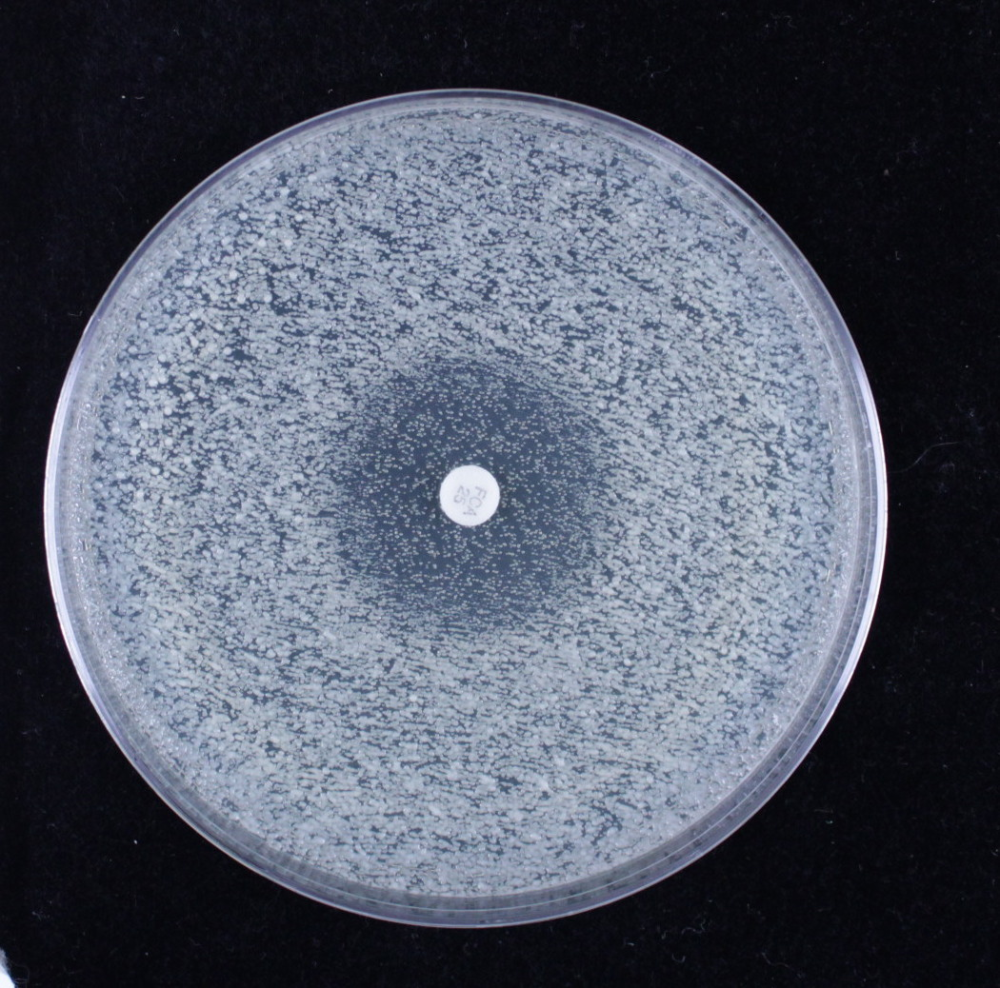

# Introduction to diskImageR

### January 19, 2015


Disk diffusion assays
diskImageR provides a quantitative way to analyze photographs taken from disk diffusion assays. Specifically, 

<center>
 
</center>

## Prepare plates and photographs
The analysis done by diskImageR will only be as good as your disk assay plates and the photographs you take. Plates should always be labelled on the side, not on the bottom. Care should be taken when setting up the camera to take photographs, as you want the lighting conditions to be as uniform as possible, without any shadows on the plates. Camera settings should be manual rather than automatic as much as possible. Once you have the set of photographs that you want to be analyzed together they should be placed in the same directory, with nothing else inside that directory.

Photograph naming can be used downstream to have diskImageR do a number of statistical things (e.g., averaging across replicates, caulculations of variance, t-tests). The general format is "strain_factor1_factor2_rep.pdf". Conversely, if you intend to do all the statistical analysis later, photographs can be named anything, even numbered.

Finally, photographs should be cropped carefully around the disk.

<b> Important! </b> There can not be any spaces or special characters in any of the folder names that are in the path that will lead to your pictures or the directory that you will use as the main project folder (i.e., the place where all the output files from this package will go). 

## Run the imageJ macro on the set of photographs
The first step in the diskImageR pipeline is to run the imageJ macro on the photograph directory. 

<b> Important! </b> imageJ must be installed on your computer. ImageJ is a free, public domain Java image proessing program available for download <a href="http://rsb.info.nih.gov/ij/download.html"> here</a>. Take note of the path to imageJ, as this will be needed for the first function.

From each photograph, the macro (in imageJ) will automatically determine where the disk is located on the plate, find the center of the disk, and draw 40mm lines out from the center of the disk every 5 degrees. For each line, the pixel intensity will be determined at many points along the line. This data will be stored in the folder "imageJ-out" on your computer, with one file for each photograph.

This step can be completed using one of two functions.
```r
#This function allows you to run the imageJ macro through a user-interface with pop-up boxes to select 
#where you want the main project directory to be and where to find the location of the photograph directory.
runIJ("projectName")
```

```{r}
#If you are more comfortable with R, and don't want to be bothered with pop-up boxes, use the 
#alternate function to supply the desired main project directory and photograph directory locations.
runIJManual("vignette", projectDir= getwd(), pictureDir = file.path(.libPaths(), "diskImageR", "pictures", ""), imageJLoc = "loc2")
```

Depending on where imageJ is located, the script may not run unless you specify the filepath. See
```r
?runIJ
```
for more details.

If you want to access the output of these functions in a later R session you can with
```r
readInExistingIJ("projectName") 	#can be any project name, does not have to be the same as previously used
```

## [optional] Plot the imageJ output
To plot pixel intensity from the average from all photographs use
```{r}
plotRaw("vignette", savePDF=FALSE)
```

##Run the maximum likelihood analysis
```{r}
maxLik("vignette", clearHalo=1)
```
 